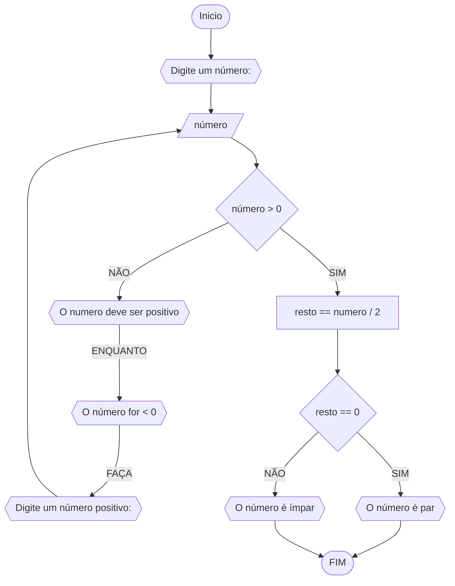
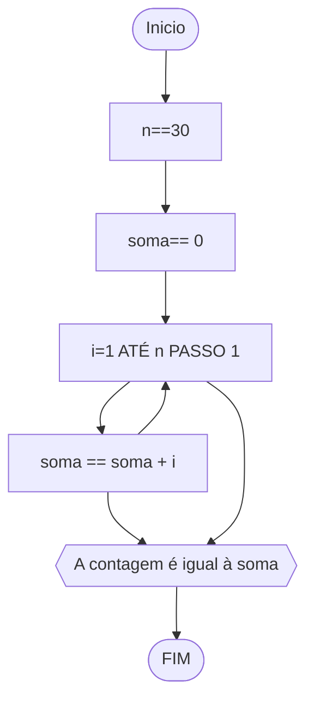
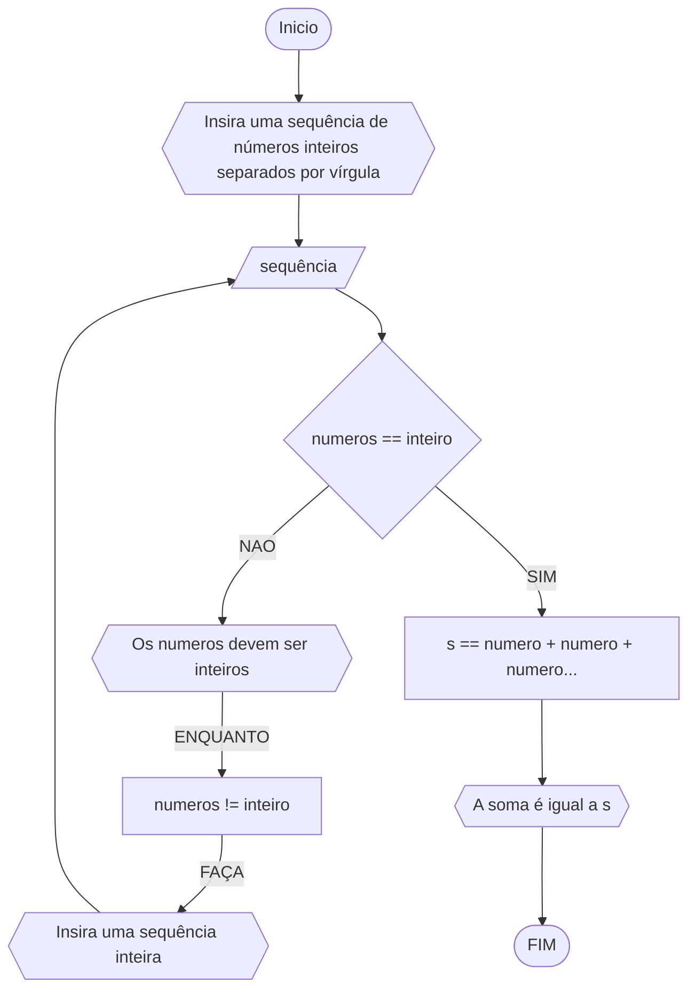

# UNIFOR
## Lista 3 de exercicios
### exercicio 1
Faça um algoritmo para determinar se um número inteiro e positivo é par ou ímpar
#### Fluxograma

``` 
ALGORITIMO impar_par
DECLARE n, r: inteiro 
INICIO
ESCREVA "Digite um número"
LEIA n
	ENQUANTO n<0 FAÇA
		ESCREVA "Digite um número positivo: "
		LEIA n
r == n / 2
	SE r == 0
		ESCREVA "O número é par"
	SENAO
		ESCREVA "O número é impar"
FIM
FIM_ALGORITIMO
```
#### teste de mesa 
| Número | Número >0 | resto | resto = 0 | saída |
| -- | -- | -- | -- | -- |
| -4 | false | | | "O número deve ser positivo" | 
| 12 | true | 0 | true | "O número é par!" | 
| 27 | true | 1 | false | "O número é ímpar!" | 
| 230 | true | 0 | true | "O número é par!" |
### exercicio 2 
 Faça um algoritmo que exiba na tela uma contagem de 0 até 30, exibindo apenas os
múltiplos de 3.
#### Fluxograma

#### pseudocódigo
DECLARE soma, n, i: inteiro
INICIO
i== 3
n== 30
soma == 0
PARA i ATE n PASSO 1 FAÇA
	soma == soma + i
 	ESCREVA "contagem é igual a soma"
FIM_PARA
FIM_ALGORITIMO


### exercício 3
#### Fluxograma

#### pseudocodigo
DECLARE sequencia, r: inteiro
INICIO
ESCREVA "Digite uma sequencia de numeros inteiros separados por virgula"
LEIA sequencia
	ENQUANTO sequência != inteiro FAÇA
 		ESCREVA "Digite uma sequência inteira"
   		LEIA sequência 
r == numero + numero + numero...
ESCREVA "Soma é igual a r"
FIM
FIM_ALGORITIMO

 	
 

