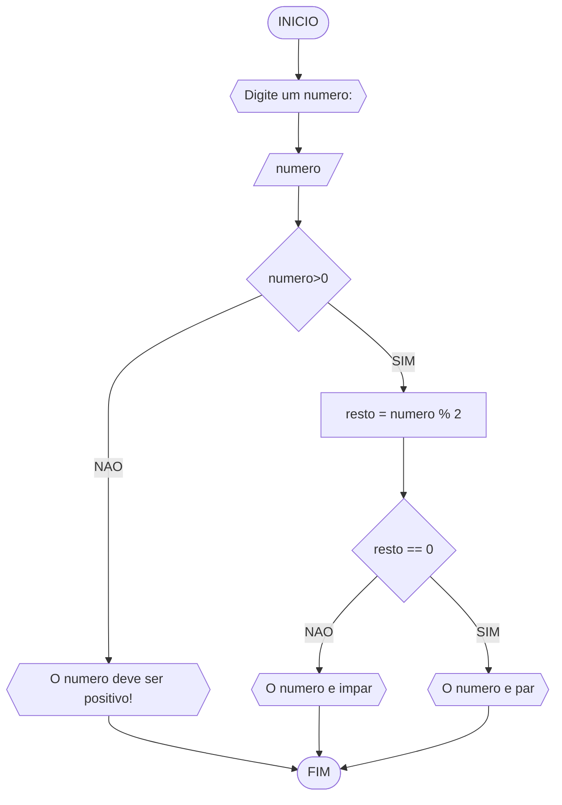
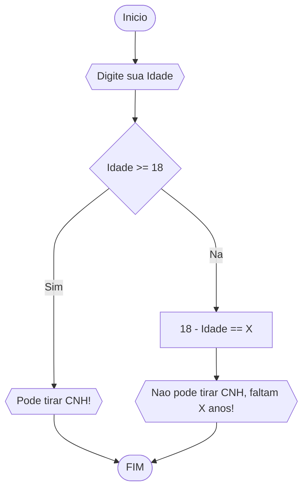

# UNIFOR
**DICIPLINA:** raciocinio logico algoritimo
**Orientador:** Prof. Ricardo Carubbi
## Lista 1 exercicio
### exercicio 3
Represente, em fluxograma e pseudocódigo, um algoritmo para determinar se um número inteiro e positivo é par ou impar.
#### Fluxograma



```
ALGORITIMO verifica_par_impar
DECLARE numero, resto INTEIRO
ESCREVA "Digite um numero"
LEIA numero
SE numero > 0 ENTAO
	resto = numero % 2
	SE resto == 0 ENTAO
		ESCREVA "O numero e par!"
	SENAO
		ESCREVA "O numero e impar!"
SENAO
	ESCREVA "O numero deve ser positivo"
FIM_ALGORITIMO

### exercicio 4
 Represente, em fluxograma e pseudocódigo, um algoritmo que, a partir da idade do
candidato(a), determinar se pode ou não tirar a CNH. Caso não atender a restrição de idade,
calcular quantos anos faltam para o candidato estar apto.
#### Fluxograma


```
ALGORITIMO tirar_CNH
DECLARE idade NUMERICO
ESCREVA "Digite sua idade"
LEIA idade
SE idade >= 18
	ESCREVA "Pode tirar CNH!"
SENAO
	X = 18 - idade
	ESCREVA "Nao pode tirar CNH! Faltam X anos"
FIM_ALGORITIMO
	
```
