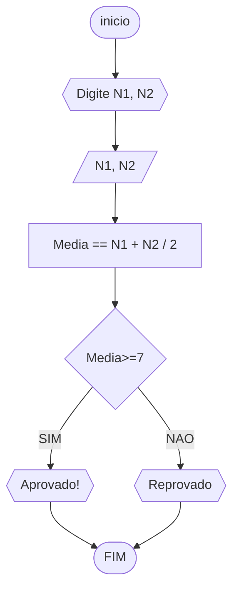
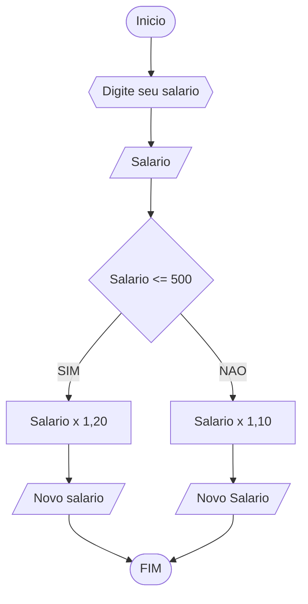

# UNIFOR
**DICIPLINA:** raciocinio logico algoritimo
**Orientador:** Prof. Ricardo Carubbi
## Lista 1 exercicio
### exercicio 1
Represente, em fluxograma e pseudocódigo, um algoritmo para determinar se um número inteiro e positivo é par ou impar.
#### Fluxograma

``` 
ALGORITIMO impar_par
DECLARE n, r: inteiro 
INICIO
	ESCREVA "Digite um número"
	LEIA n
	ENQUANTO n<0 FAÇA
		ESCREVA "Digite um número positivo: "
		LEIA n
	r == n / 2
		SE r == 0
			ESCREVA "O número é par"
		SENAO
			ESCREVA "O número é impar"
FIM
FIM_ALGORITIMO
```
|LISTA|LISTA|LISTA |teste|
 |teste|teset|teste|teste|


### exercicio 4
 Represente, em fluxograma e pseudocódigo, um algoritmo que, a partir da idade do
candidato(a), determinar se pode ou não tirar a CNH. Caso não atender a restrição de idade,
calcular quantos anos faltam para o candidato estar apto.
#### Fluxograma


```
ALGORITIMO tirar_CNH
DECLARE idade NUMERICO
ESCREVA "Digite sua idade"
LEIA idade
SE idade >= 18
	ESCREVA "Pode tirar CNH!"

SENAO
	X = 18 - idade
	ESCREVA "Nao pode tirar CNH! Faltam X anos"

FIM_ALGORITIMO
	
```


### exercicio 1 
Represente, em fluxograma e pseudocódigo, um algoritmo para calcular a média aritmética
entre duas notas de um aluno e mostrar sua situação, que pode ser aprovado ou reprovado.
#### Fluxograma


```
ALGORITIMO media_aritimetica
DECLARE x NUMERICO
DECLARE y NUMERICO
ESCREVA "Escreva nota 1 "
ESCREVA "Escreva nota 2"
LEIA x
LEIA  y 
SE x + y / 2 >= 7
	ESCREVA "Aprovado!"

SENAO
	ESCREVA "Reprovado!"

FIM_ALGORITIMO
```
### exercicio 2
Represente, em fluxograma e pseudocódigo, um algoritmo para calcular o novo salário de um
funcionário. Sabe-se que os funcionários que recebem atualmente salário de até R$ 500 terão
aumento de 20%; os demais terão aumento de 10%.
#### Fluxograma


```
ALGORITIMO novo_salario
DECLARE salario NUMERICO
ESCREVA "Digite seu salario"
LEIA salario
SE salario <=500
	novo salario == salario x 1,20
	ESCREVA "Este e seu novo salario!"
	
SENAO
	novo salario == salario x 1,10
	ESCREVA "Este e seu novo salario!"

FIM_ALGORITIMO
```

