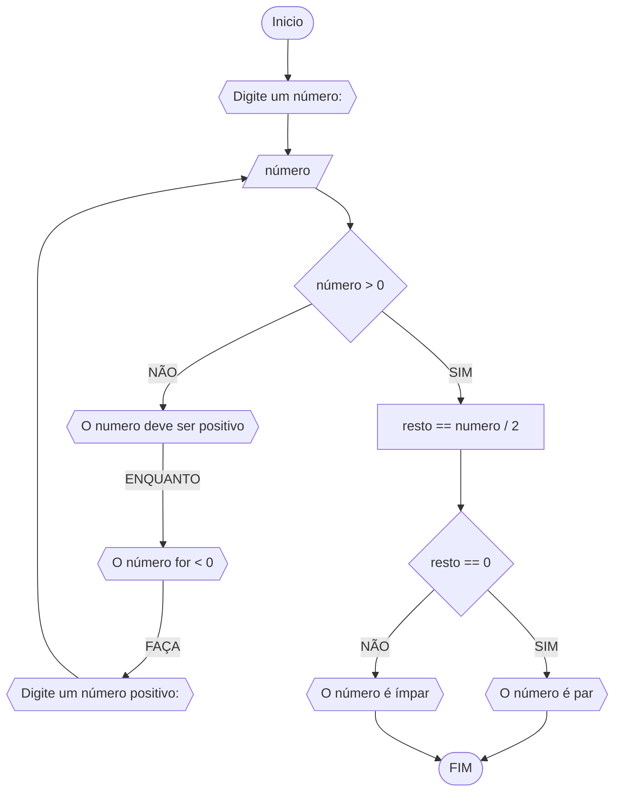
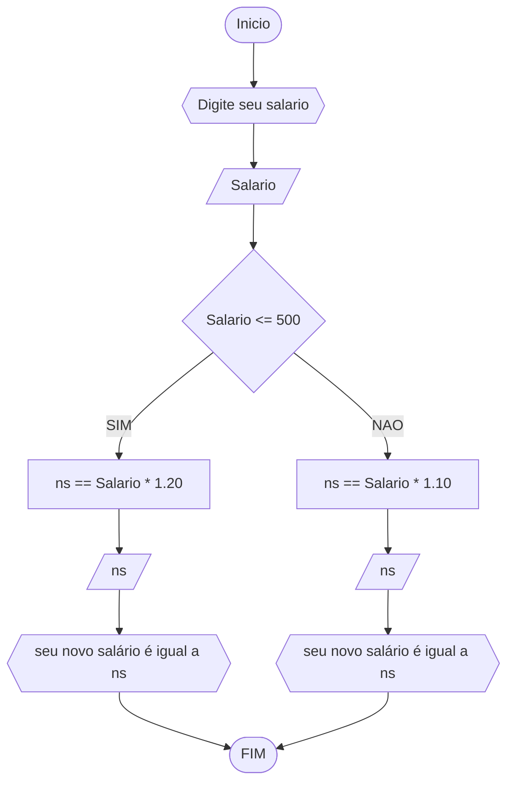
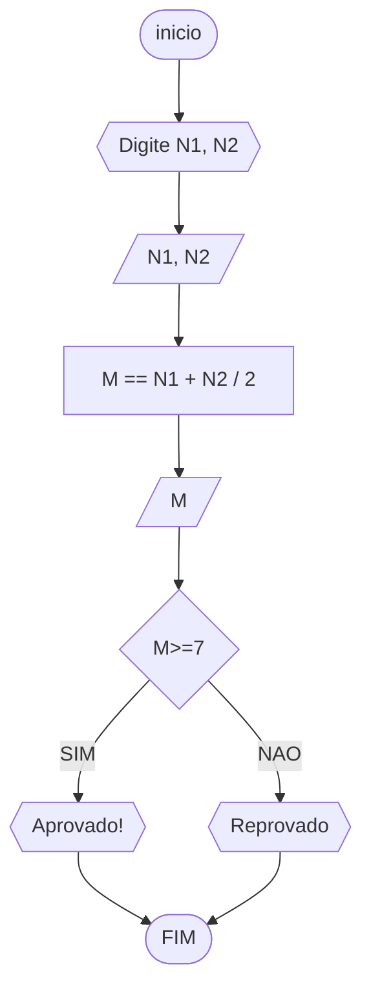
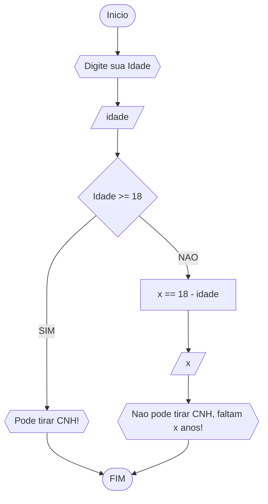

# UNIFOR
**DICIPLINA:** raciocinio logico algoritimo
**Orientador:** Prof. Ricardo Carubbi
## Lista 1 exercicio
### exercicio 1
Represente, em fluxograma e pseudocódigo, um algoritmo para determinar se um número inteiro e positivo é par ou impar.
#### Fluxograma

#### pseudocodigo
``` 
ALGORITIMO impar_par
DECLARE n, r: inteiro 
INICIO
	ESCREVA "Digite um número"
	LEIA n
	ENQUANTO n<0 FAÇA
		ESCREVA "Digite um número positivo: "
		LEIA n
	r == n / 2
		SE r == 0
			ESCREVA "O número é par"
		SENAO
			ESCREVA "O número é impar"
FIM
FIM_ALGORITIMO
```
#### teste de mesa
| numero | numero>=0 | resto | resto==0 | saida |
| -- | -- | -- | -- | -- |
|-2 | false | | | " O numero deve ser positivo!" |
| 2 | true | 0 | true | "O número é par!" |
| 7 | true | 1 | false | "O número é ímpar!" |
| 12 | true | 0 | true | "O número é par!" |


 ### exercicio 2
Represente, em fluxograma e pseudocódigo, um algoritmo para calcular o novo salário de um
funcionário. Sabe-se que os funcionários que recebem atualmente salário de até R$ 500 terão
aumento de 20%; os demais terão aumento de 10%.
#### Fluxograma


#### pseudocódigo
```
ALGORITIMO novo_salario
DECLARE salario, ns: real
INICIO
ESCREVA "Digite seu salario"
LEIA salario
	SE salario <=500
		ns == salario * 1.20
		ESCREVA "ns é seu novo salario!"
	SENAO
		ns == salario * 1.10
		ESCREVA "ns é seu novo salario!"
FIM
FIM_ALGORITIMO
```
#### teste de mesa
| salario | <= 500 | salario + 20% | salario + 10% | novo salário |
| -- | -- | -- | -- | -- |
| 500 | true | true | | 600 |
| 600 | false | | true | 660 |
| 700 | false | | true | 770 |
| 300 | true | true | | 360 | 

### exercicio 3 
Represente, em fluxograma e pseudocódigo, um algoritmo para calcular a média aritmética
entre duas notas de um aluno e mostrar sua situação, que pode ser aprovado ou reprovado.
#### Fluxograma

#### pseudocódigo
```
ALGORITIMO media_aritimetica
DECLARE n1,
	n2,
	m : real
INICIO
ESCREVA "Escreva nota 1 "
LEIA n1
ESCREVA "Escreva nota 2"
LEIA n2
m == (n1 + n2) / 2
LEIA m
	SE m >= 7
		ESCREVA "Aprovado!"
	SENAO
		ESCREVA "Reprovado!"
FIM
FIM_ALGORITIMO
```
#### teste de mesa 
| n1, n2 | média | média >= 7 | saída |
| -- | -- | -- | -- |
| 8, 10 | 9 | true | "Aluno aprovado!" | 
| 4, 8 | 6 | false | "Aluno reprovado!" | 
| 3, 5 | 4 | false | "Aluno reprovado!" |
| 10, 5 | 7.5 | true | "Aluno aprovado!" | 

### exercicio 4
 Represente, em fluxograma e pseudocódigo, um algoritmo que, a partir da idade do
candidato(a), determinar se pode ou não tirar a CNH. Caso não atender a restrição de idade,
calcular quantos anos faltam para o candidato estar apto.
#### Fluxograma


#### pseudocódigo
```
ALGORITIMO tirar_CNH
DECLARE idade, x : inteiro
INICIO
ESCREVA "Digite sua idade"
LEIA idade
	SE idade >= 18
		ESCREVA "Pode tirar CNH!"
	SENAO
		x = 18 - idade
		ESCREVA "Nao pode tirar CNH! Faltam X anos"
FIM
FIM_ALGORITIMO	
```
#### teste de mesa 
| idade | idade >= 18 | anos que faltam | saída |
| -- | -- | -- | -- |
| 15 | false | 3 | "Não pode tirar CNH" | 
| 18 | true | | Pode tirar CNH" | 
| 25 | true | | "Pode tirar CNH" | 
| 17 | false | 1 | "Não pode tirar CNH" | 
