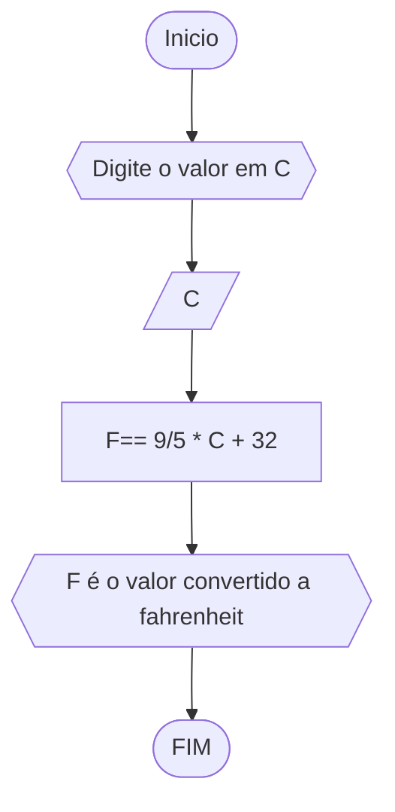
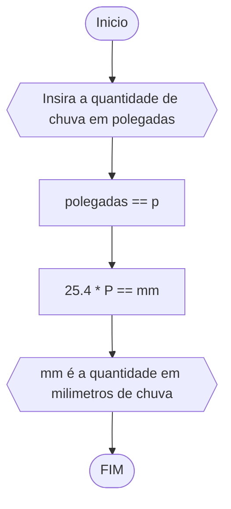
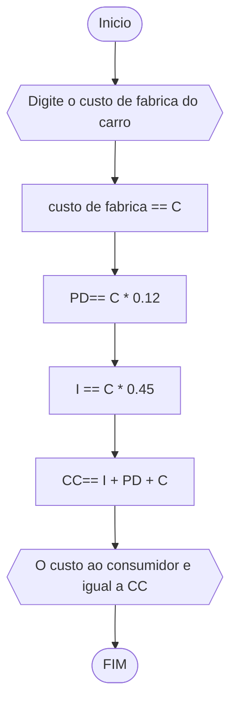
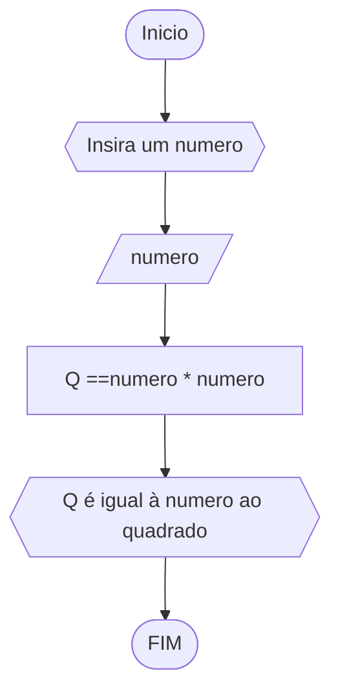
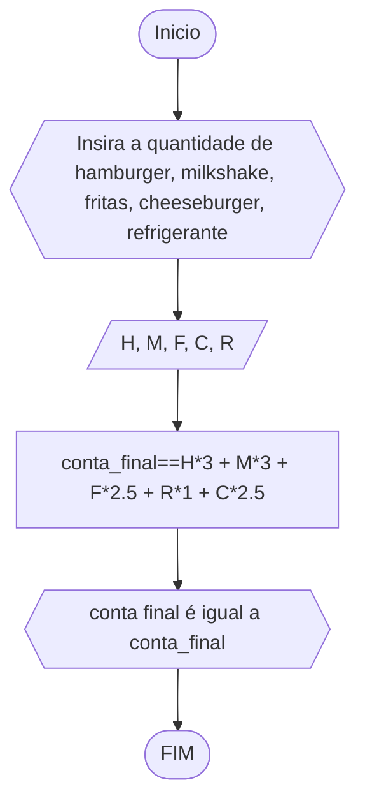
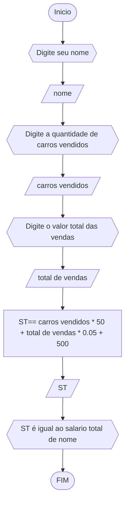
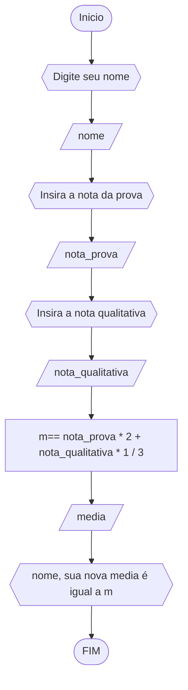
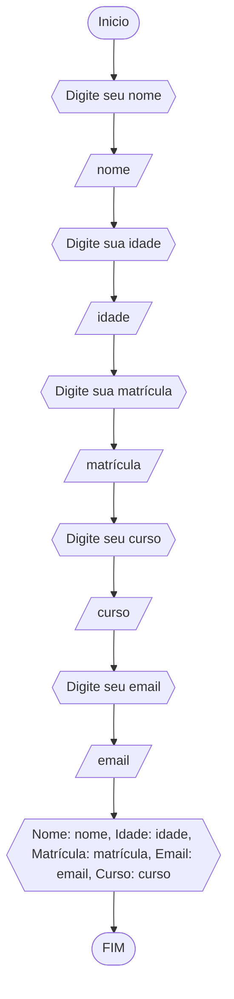

# Unifor
## Lista 2 de exercicios 
### exercicio 1 
Calcule a média de quatro números inteiros dados.
#### Fluxograma 


```
ALGORITIMO media_4_numeros
DECLARE n1, n2, n3. n4, m: real
INICIO
	ESCREVA "Digite n1"
	LEIA n1
	ESCREVA "Digite n2"
	LEIA n2
	ESCREVA "Digite n3"
	LEIA n3
	ESCREVA "Digite n4"
	LEIA n4
	m == (n1 + n2 + n3 + n4) / 4 
	ESCREVA " media dos números é igual à m"
FIM
FIM_ALGORITIMO
```
### exercicio 2 
Leia uma temperatura dada na escala Celsius (C) e imprima o equivalente em Fahrenheit
#### Fluxograma 

``` 
ALGORITIMO transformar_celsius_em_fahrenheit
DECLARE c, f: real
INICIO
	ESCREVA "Digite o valor em c"
	LEIA c
	f== (9/5) * c + 32 
	ESCREVA " f é o novo valor em fahrenheit"
FIM
FIM_ALGORITIMO
``` 
### exercício 3
Leia uma quantidade de chuva dada em polegadas e imprima o equivalente em milímetros
#### Fluxograma 

```
ALGORITIMO polegadas_para_milimetros
DECLARE polegadas: real
INICIO 
	ESCREVA "insira a quantidade em polegadas"
	LEIA polegadas 
	polegadas * 25.4 == NQ
	ESCREVA "NQ é a quantidade de chuva em milimetros" 
FIM
FIM_ALGORITIMO
```
### exercício 4
O custo ao consumidor de um carro novo é a soma do custo de fábrica com a porcentagem do distribuidor e dos impostos, ambos aplicados ao custo de fábrica. Supondo que a porcentagem do distribuidor seja de 12% e a dos impostos de 45%, prepare um algoritmo para ler o custo de fábrica do carro e imprimir o custo ao consumidor.
#### Fluxograma

```
ALGORITIMO custo_ao_consumidor
DECLARE i, pd, c ,cc: real
INICIO 
	ESCREVA "Digite o valor do custo de fabrica do carro"
	LEIA c 
	i == c * 0.45 
	pd ==c *0.12
	cc ==c +  pd + i
	ESCREVA "cc e o valor de custo ao consumidor"
FIM
FIM_ALGORITIMO
```
### exercício 5
Calcule o quadrado de um número.

#### Fluxograma

```
ALGORITIMO numero_ao_quadrado
DECLARE n, q: inteiro
INICIO
	ESCREVA "Digite um numero"
	LEIA n
	q == n  * n
	LEIA Q 
	ESCREVRA "q é igual a n ao quadrado"
FIM
FIM_ALGORITIMO
```
### exercício 6
O cardápio de uma lanchonete é dado abaixo. Prepare um algoritmo que leia a quantidade de cada item que você consumiu e calcule a conta final. 
a) Hambúrguer................ R$ 3,00 
b) Cheeseburger.............. R$ 2,50
c) Fritas.................... R$ 2,50 
d) Refrigerante ............. R$ 1,00
e) Milkshake................. R$ 3,00

#### Fluxograma

```
ALGORITIMO cardapio_lanchonete
DECLARE qh, qc, qf, qr, qm, conta_final: real
INICIO 
	ESCREVA "Digite a quantidade de hamburger"
	LEIA qh
	ESCREVA "Digite a quantidade de refrigerante"
	LEIA qr
	ESCREVA "Digite a quantidade de fritas"
	LEIA qf
	ESCREVA "Digite a quantidade de milkshake"
	LEIA qm
	ESCREVA "Digite a quantidade de cheeseburger"
	LEIA qc
	conta_final == (3 * qh) + 
                       (2.5 *qc) +
                       (1 *qr) +
	               (2.5 *qf) +
	               (3 *qm )  
	ESCREVA "conta final é igual a conta_final"
FIM
FIM_ALGORITIMO
```
### exercício 7
Uma companhia de carros paga a seus empregados um salário de R$ 500,00 por mês mais uma comissão de R$ 50,00 para cada carro vendido e mais 5% do valor da venda. Elabore um algoritimo para calcular e imprimir o salário do vendedor num dado mês recebendo como dados de entrada o nome do vendedor, o número de carros vendidos e o valor total das vendas. 
#### Fluxograma 

```
ALGORITIMO salario_total
DECLARE carros_vendidos : inteiro
	st,
	total_de_vendas: real
        nome: caractere
INICIO 
	ESCREVA "Digite seu nome" 
	LEIA nome
	ESCREVA "Digite a quantidade de carros vendidos"
	LEIA carros_vendidos
	ESCREVA "Digite a o valor total das vendas"
	LEIA total_de_vendas
	st == (carros_vendidos * 50) + 
		  (total_de_vendas * 0.05) + 500
	ESCREVA "nome, seu salario total é igual a st"
FIM
FIM_ALGORITIMO
```
### exercício 8 
Calcule a média de um aluno na disciplina de RLA. Para isso solicite o nome do aluno, a nota da prova e a nota qualitativa. Sabe-se que a nota da prova tem peso 2 e a nota qualitativa peso 1. Mostre a média como resultado.
#### Fluxograma


```
ALGORITIMO media_com_peso
DECLARE m, nota_qualitativa, nota_prova: real
	 nome: caractere
INICIO
	ESCREVA "Digite seu nome"
	LEIA nome
	ESCREVA "Digite a nota da prova"
	LEIA nota_prova
	ESCREVA "Digite a nota qualitativa"
	LEIA nota_qualitativa
	m== (nota_prova * 2 + nota_qualitativa * 1) / 3 
	ESCREVA "nome, sua nova média é igual a m"
FIM
FIM_ALGORITIMO
```
### exercício 9
Suponha que você deseja preencher a seguinte ficha de inscrição de um estudante: nome,
matrícula, curso, email, idade. Imprima os dados do usuario como uma ficha preenchida
#### Fluxograma

```
ALGORITIMO ficha_de_inscrição
DECLARE nome,
	curso,
	email : caractere
	idade,
	matrícula : inteiro
INICIO
	ESCREVA "Digite seu nome"
	LEIA nome
	ESCREVA "Digite seu curso"
	LEIA curso
	ESCREVA "Digite seu email"
	LEIA email
	ESCREVA "Digite sua matrícula"
	LEIA matrícula
	ESCREVA "Digite sua idade"
	LEIA idade
	ESCREVA "Nome: nome
		 Idade: idade
		 Curso: curso
		 Email: email
		 Matrícula: matrícula"
FIM
FIM_AGORITIMO
```
### exercício 4 atualizado
---
#### Fluxograma

```
ALGORITIMO calculadora
DECLARE n1, n2, r: real
	operador: caractere 
INICIO
ESCREVA "Digite o primeiro numero"
LEIA n1
ESCREVA "Digite o segundo número"
LEIA n2
ESCREVA "Digite o operador"
LEIA operador
ESCOLHA
	CASO operador == +
             r== n1+n2
	     ESCREVA " r é o resultado"
	CASO operador == *
             r== n1*n2
	     ESCREVA " r é o resultado"
	CASO operador == %
             r== n1%n2
	     ESCREVA " r é o resultado"
	CASO operador == -
             r== n1-n2
	     ESCREVA " r é o resultado"
	SENAO
	     ESCREVA "O operador não é valido"
FIM
FIM_ALGORITIMO
