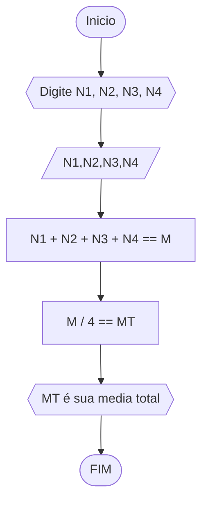

# Unifor
## Lista 2 de exercicios 
### exercicio 1 
Calcule a média de quatro números inteiros dados.
#### Fluxograma 


```
ALGORITIMO media_4_numeros
DECLARE n1, n2, n3. n4, media NUMERICOS 
INICIO
	ESCREVA "Digite n1"
	LEIA n1
	ESCREVA "Digite n2"
	LEIA n2
	ESCREVA "Digite n3"
	LEIA n3
	ESCREVA "Digite n4"
	LEIA n4
	media == (n1 + n2 + n3 + n4) / 4 
	ESCREVA " media dos números ==M"
FIM
FIM_ALGORITIMO
```
### exercicio 2 
Leia uma temperatura dada na escala Celsius (C) e imprima o equivalente em Fahrenheit
#### Fluxograma 

``` 
ALGORITIMO transformar_celsius_em_fahrenheit
DECLARE c, f NUMERICO
INICIO
	ESCREVA "Digite o valor em c"
	LEIA c
	f== (9/5) * c + 32 
	ESCREVA " f é o novo valor em fahrenheit"
FIM
FIM_ALGORITIMO
``` 
```
