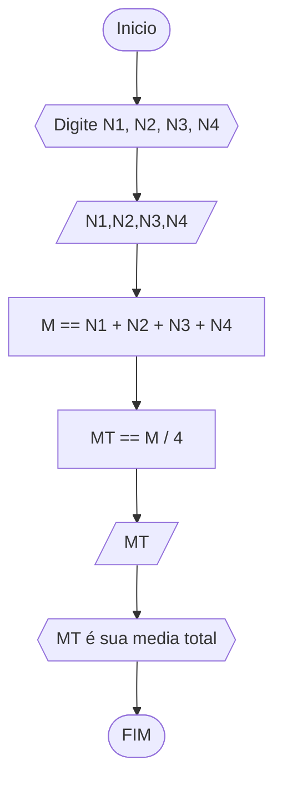
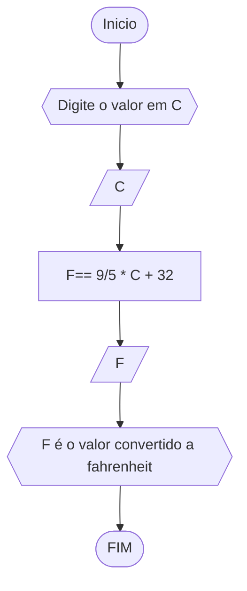
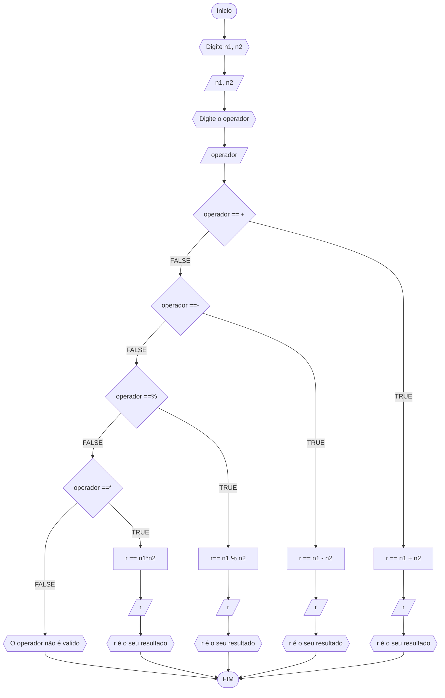
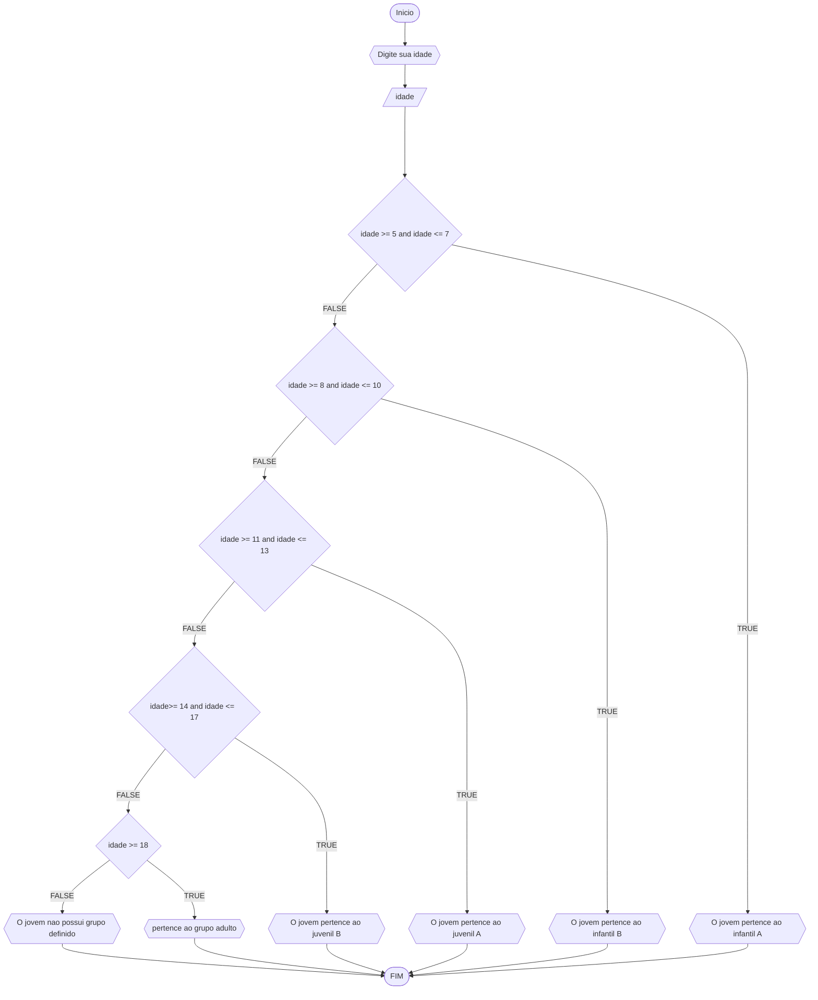

# Unifor
## Lista 2 de exercicios 
### exercicio 1 
Calcule a média de quatro números inteiros dados.
#### Fluxograma 


#### pseudocódigo
```
ALGORITIMO media_4_numeros
DECLARE n1, n2, n3. n4, : inteiro
	m : real
INICIO
ESCREVA "Digite n1"
LEIA n1
ESCREVA "Digite n2"
LEIA n2
ESCREVA "Digite n3"
LEIA n3
ESCREVA "Digite n4"
LEIA n4
m == (n1 + n2 + n3 + n4) / 4 
ESCREVA " media dos números é igual à m"
FIM
FIM_ALGORITIMO
```
#### teste de mesa
| numeros | media | saida |
| -- | -- | -- |
| 10, 8, 4 , 2| 6 | "A media é igual a 6" | 
| 3, 1, 6 , 12| 5.5 |"A media é igual a 5.5" | 
|6, 4, 8, 6 | 6 | "A media é igual a 6" |
|10, 20, 10 , 0| 10 | "A media é igual a 10" |

### exercicio 2 
Leia uma temperatura dada na escala Celsius (C) e imprima o equivalente em Fahrenheit
#### Fluxograma 

``` 
ALGORITIMO transformar_celsius_em_fahrenheit
DECLARE c, f: real
INICIO
ESCREVA "Digite o valor em c"
LEIA c
f== (9/5) * c + 32 
ESCREVA " f é o novo valor em fahrenheit"
FIM
FIM_ALGORITIMO
```
#### teste de mesa 
| valor em C | valor em Fahrenheit | saída |
| -- | -- | -- |
| 25 | 77 | "O valor convertido para fahrenheit é de 77 F " |
| 18 | 64.4 | "O valor convertido para fahrenheit é de 64.4 F" |
| 28| 82.4 | "O valor convertido para fahrenheit é de 82.4 F " | 
| 21 | 69.8 | "O valor convertido para fahrenheit é de 69.8 F" | 

```

```
### exercício 3 atualizado
Receba dois números reais e um operador e efetue a operação correspondente com os
valores recebidos (operandos). O algoritmo deve retornar o resultado da operação
selecionada simulando todas as operações de uma calculadora simples
#### Fluxograma

```
ALGORITIMO calculadora
DECLARE n1, n2, r: real
	operador: caractere 
INICIO
ESCREVA "Digite o primeiro numero"
LEIA n1
ESCREVA "Digite o segundo número"
LEIA n2
ESCREVA "Digite o operador"
LEIA operador
ESCOLHA
	CASO operador == +
		r== n1+n2
		ESCREVA " r é o resultado"
	CASO operador == *
		r== n1*n2
		ESCREVA " r é o resultado"
	CASO operador == %
		r== n1%n2
		ESCREVA " r é o resultado"
	CASO operador == -
		r== n1-n2
		ESCREVA " r é o resultado"
	SENAO
		ESCREVA "O operador não é valido"
FIM
FIM_ALGORITIMO
```
#### teste de mesa 
| Insira n1, n2 | Insira o operador | operador é válido | resultado |
| -- | -- | -- | -- |
| 4, 6 | + | true | 10 | 
| 9, 3 | - | true | 6 | 
| 10, 5 | % | true | 2 | 
| 12, 2 | . | false | | 
### Exercício 4 atualizado
Elaborar um algoritmo que, dada a idade, classifique nas categorias: infantil A (5 - 7 anos),
infantil B (8 -10 anos), juvenil A (11 - 13 anos), juvenil B (14 -17 anos) e adulto (maiores que
18 anos)
#### Fluxograma

```
ALGORÌTIMO grupo_idade
DECLARE idade: inteiro
INICIO
ESCREVA "Digite sua idade"
LEIA idade
ESCOLHA
	CASO idade >= 5 and idade <= 7
	     ESCREVA "O jovem pertence ao ifantil A"
	CASO idade >= 8 and idade <= 10
  	     ESCREVA "O jovem pertence ao infantil B"
	CASO idade >= 11 and idade <= 13
	     ESCREVA "O jovem pertence ao juvenil A"
	CASO idade >= 14 amd idade <= 17
	     ESCREVA "O jovem pertence ao juvenil B"
	CASO idade >= 18
             ESCREVA "pertence ao grupo adulto"
	SENAO
	     ESCREVA "O jovem nao possui grupo definido"
FIM
FIM_ALGORITIMO
```
#### teste de mesa
| Idade | idade < 5 | 5=<idade<=7 | 8<=idade<=10 | 11<=idade<=13 | 14<=idade<=17| idade>=18 | saída |
| -- | -- | -- | -- | -- | -- | -- | -- |
| 10 | false | false | true | false | false | false | "O jovempertence ao infantil B" | 
| 3 | true | false | false | false | false | false | "O jovem não possui grupo definido" | 
| 12 | false | false | false | true | false | false | "O jovem pertence ao grupo juvenil A" | 
| 25 | false | false | false | false | false | true | "Pertence ao grupo adulto" | 

